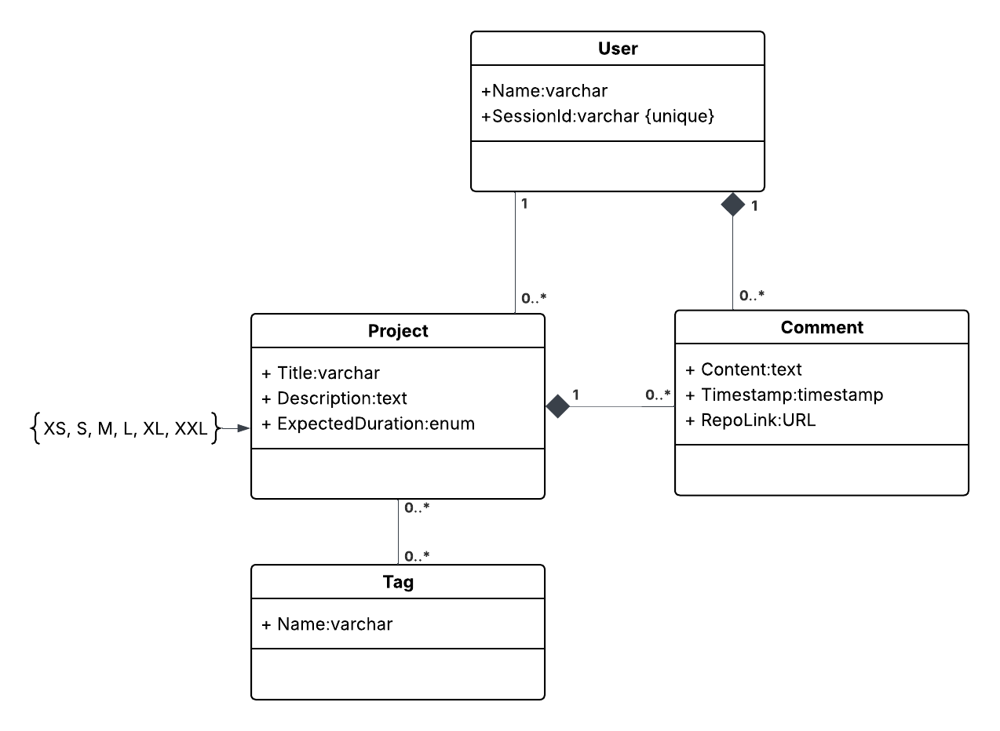

# Project specification

Title: debug-dungeon
Description: Database of educational mini-projects.

## General concept

1. list all ideas -> searching/filtering by tags -> mini-project details

2. submit new project idea -> form -> details page
 - project title
 - details
 - tags
 - expected time: T-shirt sizes

3. details page on the mini-projects
 - what kinda project is that
 - comments
 - submit links for your implementation

## Views

1. list of projects/ideas + modal about page
2. project details page + comments with links to implementation + submit your own
3. form to submit new ideas

## Technology stack

Backend: django, django-rest-framework

Frontend: nuxt

## Models

